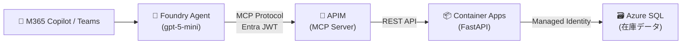
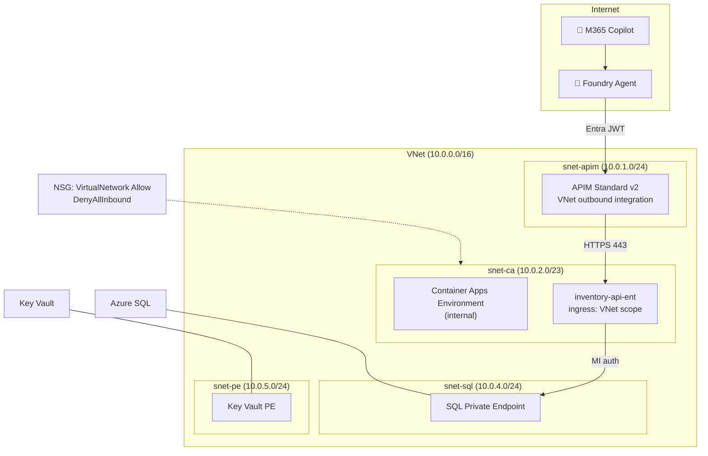

# Inventory Agent — Foundry + APIM MCP + M365 Copilot

Foundry エージェントが APIM (MCP Server) 経由で在庫 REST API を参照し、M365 Copilot / Teams で動くデモ。
`enableEnterpriseSecurity=true` でエンタープライズ本番構成（VNet, PE, KV, Defender, MI）に切り替え可能。

## Architecture

### 論理アーキテクチャ



### Enterprise ネットワーク構成



## Quick Start

```bash
# デモ（public 構成）
azd auth login
azd up

# 本番（VNet + Private Endpoint + Key Vault + Defender + Managed Identity）
azd env set ENABLE_ENTERPRISE_SECURITY true
azd up

# ローカル開発
cd src && uv pip install -r requirements.txt
uvicorn main:app --reload   # → http://localhost:8000/docs

# テスト
curl http://localhost:8000/health
curl http://localhost:8000/inventory/INV-004

# クリーンアップ
azd down --purge
```

## `azd up` 後の手動ステップ（初回のみ）

| # | 手順 | 理由 |
|---|------|------|
| 1 | APIM → MCP Servers → Create MCP server | ARM API 未対応 |
| 2 | APIM → Network → VNet integration 有効化確認 | ポータル確認推奨 |
| 3 | `scripts/setup-entra.sh` で Entra App 登録 | テナント操作 |
| 4 | Foundry ポータルで M365 Copilot に publish | Bot Service + メタデータ |

MCP Server 作成後に `azd provision` を再実行すると、JWT + rate-limit policy が自動適用される。

## Tech Stack

| レイヤー | 技術 |
|---------|------|
| AI | Foundry Agent (gpt-5-mini) + MCP Protocol |
| API Gateway | APIM Standard v2 (MCP Server, JWT, rate-limit) |
| Backend | FastAPI / Python 3.12 / uvicorn |
| Database | Azure SQL (Entra ID Only, Managed Identity) |
| Container | Container Apps (workload profiles, ACR remote build) |
| IaC | azd + Bicep |
| Auth | Entra ID (`validate-azure-ad-token` + ProjectManagedIdentity) |

## Enterprise Security

`enableEnterpriseSecurity=true` で有効化:

- **ネットワーク分離**: VNet + 4 サブネット + NSG (DenyAllInbound)
- **Container Apps**: internal CAE + VNet-scope ingress（インターネット非公開）
- **Private Endpoint**: SQL, Key Vault（public access disabled）
- **認証**: Managed Identity (Container Apps → SQL, ACR pull)、Entra JWT (APIM MCP)
- **監視**: Application Insights (APIM, CA)、Log Analytics
- **防御**: Defender for Cloud (SQL, Containers, Key Vault)

詳細は [docs/enterprise-security.md](docs/enterprise-security.md) を参照。

## 自動化の範囲

`azd up` の postprovision hook (`scripts/postprovision.py`) で以下が自動実行される:

1. Foundry project 作成
2. Private DNS Zone 作成（internal CAE 用）
3. SQL データ投入 + MI ユーザー権限付与
4. APIM REST API import（OpenAPI spec 自動生成）
5. Foundry project connection 作成（ProjectManagedIdentity）
6. MCP policy 適用（MCP Server 存在時のみ）
7. Foundry agent 作成（MCP ツール + PMI 認証）
8. Agent Application publish

## M365 Copilot への公開

Agent Application の publish は自動化済み。M365 Copilot/Teams への配信は Foundry ポータルから手動:

1. Foundry ポータル → agent → **Publish** → **Publish to Teams and M365 Copilot**
2. Bot Service 作成 → メタデータ入力 → Prepare Agent
3. Scope: Individual（テスト）or Organization（本番、管理者承認要）

| フィールド | 値の例 |
|-----------|--------|
| Name | Inventory Assistant |
| Short description | AI assistant that queries inventory data via MCP tools |
| Full description | Calls inventory REST API through APIM MCP |
| Publisher | Your Org Name |
| Website | https://example.com |
| Privacy / Terms | https://example.com/privacy, https://example.com/terms |

## Project Structure

```
src/main.py              ← FastAPI 在庫 REST API
infra/                   ← Bicep (azd provision)
  core/                  ← 個別モジュール (SQL, APIM, CA, Foundry, etc.)
scripts/
  postprovision.py       ← azd up 後の自動セットアップ
  create_agent.py        ← Foundry agent 作成
  test_agent.py          ← Foundry agent テスト
  setup.sql              ← サンプルデータ 20 件
  setup-entra.sh         ← Entra ID app registration
  mcp-policy.json        ← MCP API JWT + rate-limit policy (テンプレート)
docs/
  enterprise-security.md ← セキュリティ設計詳細
```

## ハマりポイント

- internal CAE で `ingress.external: false` → CA Environment 内のみ到達可。APIM から 404
- NSG source は `VirtualNetwork` タグで許可。サブネット CIDR では不十分
- APIM `validate-azure-ad-token` は MCP API スコープのみ。service 全体だと内部 tool call が 401
- APIM Frontend Response payload bytes = 0 を維持（MCP SSE 安定性）
- M365 publish の Name フィールドは英語のみ（日本語はエラー）

## License

MIT
