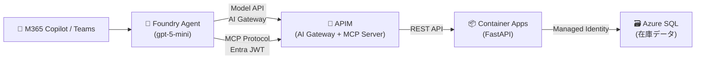
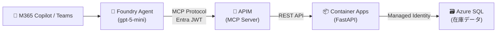
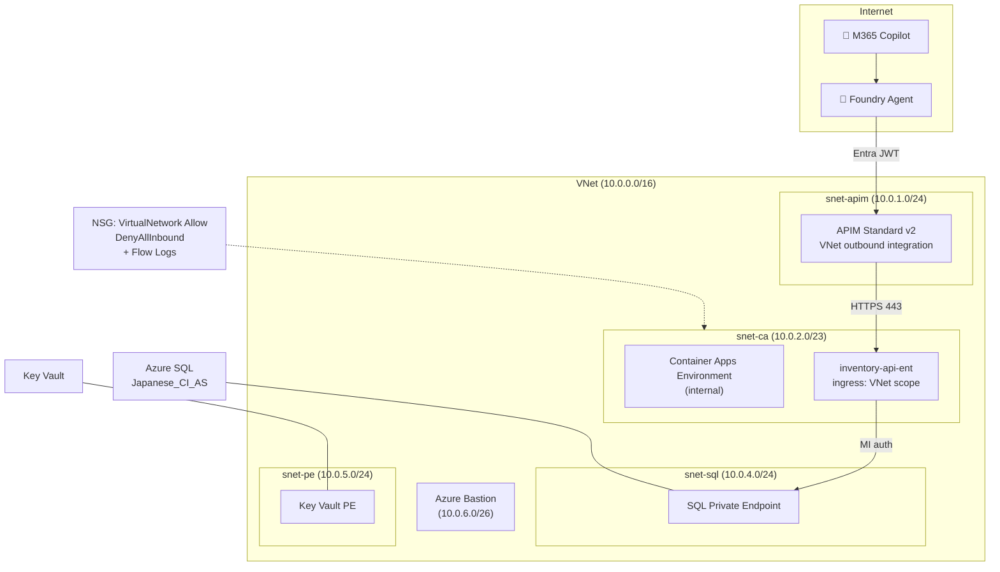

# Inventory Agent — Foundry + APIM MCP + M365 Copilot

[](https://github.com/naoki1213mj/M365Copilot-FoundryAgent-APIM-ACA_MCP-DB/actions/workflows/ci.yml)

Foundry エージェントが APIM (MCP Server) 経由で在庫 REST API を参照し、M365 Copilot / Teams で動くデモ。
`enableEnterpriseSecurity=true` でエンタープライズ本番構成（VNet, PE, KV, Bastion, Defender, MI, Grafana, アラート）に切り替え可能。
`USE_AI_GATEWAY=true`（デフォルト）で APIM を AI Gateway として Foundry に接続し、モデル呼び出しもガバナンス対象にできる。

## Architecture

### 論理アーキテクチャ（AI Gateway 経路）



### 論理アーキテクチャ（従来経路）



### Enterprise ネットワーク構成



## API エンドポイント

| エンドポイント | 説明 | MCP ツール化 |
|-------------|------|------------|
| `GET /products` | 商品一覧 (category 絞り込み) | ✅ |
| `GET /products/{code}` | 商品コードで 1 件検索 | ✅ |
| `GET /inventory` | 在庫一覧 (倉庫/カテゴリ/発注点割れ) | ✅ |
| `GET /inventory/alerts` | 発注点割れ商品 (shortage/fill_rate ソート) | ✅ |
| `GET /warehouses` | 倉庫一覧 + 在庫サマリ | ✅ |
| `GET /warehouses/{code}/stock` | 特定倉庫の在庫詳細 + カテゴリサマリ | ✅ |

## Database

3 テーブル構成（正規化済み）:

| テーブル | 件数 | 説明 |
|---------|------|------|
| `products` | 20 | 商品マスタ (product_code, category, unit_price, reorder_point, supplier) |
| `warehouses` | 3 | 倉庫マスタ (WH-E=East, WH-C=Central, WH-W=West) |
| `inventory` | 31 | 在庫 (商品×倉庫, quantity, reserved, available=計算列). 発注点割れ 8 件 |

## 前提条件

### 必要なツール

| ツール | バージョン | 用途 |
|-------|-----------|------|
| Azure CLI (`az`) | 最新 | リソース管理、APIM 操作、SQL 操作 |
| Azure Developer CLI (`azd`) | 1.10+ | provision / deploy のオーケストレーション |
| Python | 3.12+ | FastAPI アプリ、postprovision スクリプト |
| PowerShell | 7.0+ | azd hooks（Windows / Linux 両対応） |
| ODBC Driver 18 for SQL Server | 18.0+ | SQL 接続（Docker / Codespaces では自動） |

### Azure サブスクリプション権限

`azd up` を実行するユーザーに以下のロールが必要:

| ロール | スコープ | 理由 |
|-------|---------|------|
| **Contributor** | サブスクリプション or RG | SQL, APIM, CA, ACR, VNet, KV 等のリソース作成 |
| **User Access Administrator** | サブスクリプション or RG | MI のロール割り当て（ACR pull → CA, SQL → CA） |

> **Owner** ロールがあれば Contributor + User Access Administrator の両方を含むので 1 つで足りる。

### Entra ID (Azure AD) 権限

| 権限/ロール | 理由 | 代替手段 |
|------------|------|---------|
| **アプリ登録が許可されていること** | MCP policy 用の Entra App 自動登録 (step 5) | テナント設定で無効の場合 → `Application Developer` ロール or 手動で `bash scripts/setup-entra.sh` |
| **Azure AI Developer** | Foundry project / workspace 操作 | postprovision が自動付与するが、伝播に数分かかる |
| **Cognitive Services User** | Agent SDK 2.x での Agent 作成・実行（`AIServices/agents/*` data actions） | postprovision が自動付与。Azure AI Developer では Agent 操作の data actions がカバーされない |

Entra App 登録の可否は postprovision が自動チェックする:
```bash
az rest --url "https://graph.microsoft.com/v1.0/policies/authorizationPolicy" \
  --query "defaultUserRolePermissions.allowedToCreateApps"
# true → 自動登録 / false → 手動手順を案内
```

### Enterprise モード追加要件

`ENABLE_ENTERPRISE_SECURITY=true` の場合、追加で以下が必要:

| リソース | 追加権限 |
|---------|---------|
| Key Vault | Key Vault Secrets Officer（Bicep が自動付与） |
| Defender for Cloud | サブスクリプションレベルの有効化権限 |
| NSG Flow Logs | Storage Account + Log Analytics への書き込み権限 |
| Azure Bastion | Bastion + Public IP 作成権限（Contributor に含む） |

## Quick Start

```bash
# デモ（public 構成、AI Gateway 有効）
azd auth login
azd up

# 従来経路（AI Gateway 無効）
azd env set USE_AI_GATEWAY false
azd up

# 本番（エンタープライズ構成フル + AI Gateway）
azd env set ENABLE_ENTERPRISE_SECURITY true
azd env set ALERT_EMAIL_ADDRESS ops@example.com
azd up

# ローカル開発
cp .env.sample .env  # 値を設定
cd src && pip install -r requirements.txt
uvicorn main:app --reload   # → http://localhost:8000/docs

# テスト
curl http://localhost:8000/health
curl http://localhost:8000/products/PRD-001
curl http://localhost:8000/inventory/alerts
curl http://localhost:8000/warehouses/WH-E/stock

# ユニットテスト
pytest tests/ -v

# クリーンアップ
azd down --purge
```

## `azd up` 後の手動ステップ

> Entra App 登録は `postprovision` が権限チェック後に自動実行する。権限がない場合のみ手動が必要（手順は postprovision の出力に表示される）。

### Step 1: APIM VNet integration 確認 (enterprise のみ)

Azure ポータル → APIM → **Network** → **送信** で VNet integration が有効化されていることを確認。
APIM Standard v2 の outbound VNet integration は Bicep で `virtualNetworkType: External` を設定済みだが、ポータルで確認推奨。

### Step 2: APIM MCP Server 作成

> MCP Server の ARM API は未公開のためポータル手動操作が必要（AI Gateway / 従来経路の両方で必要）。

1. Azure ポータル → APIM → 左メニュー **MCP Servers**
2. **+ Create MCP server** をクリック
3. 設定:
   - **Source API**: `Inventory API`
   - **Name**: `inventory-mcp`（任意だが postprovision がこの名前を探す）
   - 全オペレーションを選択
4. **Create**

作成後の MCP endpoint: `https://<apim-name>.azure-api.net/inventory-mcp/mcp`

### Step 3: MCP policy 適用 + Agent 再作成

MCP Server 作成後に postprovision を再実行。Step 8 (MCP policy) と Step 9 (Agent) が自動実行される。

```bash
# azd env の値をシェルに読み込んで postprovision を実行
# Windows (PowerShell)
azd env get-values | ForEach-Object { if ($_ -match '^([^=]+)="?([^"]*)"?$') { [Environment]::SetEnvironmentVariable($matches[1], $matches[2]) } }
python scripts/postprovision.py

# postprovision 実行後の確認
# MCP policy: validate-azure-ad-token + rate-limit-by-key が適用されているか
# Agent: inventory-ent-pmi が作成されているか
```

### Step 4: Agent テスト

```bash
# Foundry ポータルのプレイグラウンドで直接テスト、または:
export FOUNDRY_PROJECT_ENDPOINT=$(azd env get-value FOUNDRY_PROJECT_ENDPOINT)
export AGENT_NAME=inventory-ent-pmi
python scripts/test_agent.py
```

テスト質問例:
- 「East Warehouse で発注点割れしている商品を教えて」
- 「Electronics カテゴリの在庫一覧」
- 「PRD-005 の商品情報を見せて」
- 「各倉庫の在庫サマリを教えて」
- 「PRD-001 の在庫は各倉庫にどれくらいある？」
- 「West Warehouse で充足率が一番低い商品は？」
- 「PRD-999 の情報を教えて」（存在しないコード → 該当なしを確認）
- 「PRD-001 の在庫を100に変更して」（書き込み → 読み取り専用と回答されることを確認）

### ユースケース例

| ユースケース | 質問例 | 使われる MCP ツール |
|------------|-------|------------------|
| 商品検索 | 「PRD-003 の商品情報は？」 | get-products-by-code |
| カテゴリ一覧 | 「Office Supplies の商品を一覧で」 | get-products |
| 発注点割れ確認 | 「発注推奨の商品はある？」 | get-inventory-alerts |
| 倉庫別在庫照会 | 「Central Warehouse の在庫詳細を見せて」 | get-warehouses-stock-by-code |
| 倉庫サマリ | 「各倉庫のアラート件数は？」 | get-warehouses |
| 複合質問 | 「PRD-008 の全倉庫の在庫と充足率を教えて」 | get-inventory |

### Step 5: M365 Copilot に公開

1. **Foundry ポータル** → `inventory-project` → Agents → `inventory-ent-pmi`
2. **Publish** → **Publish to Teams and M365 Copilot**
3. Bot Service 作成画面でメタデータを入力:

| フィールド | 値 |
|-----------|---|
| Name | `Inventory Assistant`（英語のみ） |
| Short description | `AI assistant that queries inventory data via MCP tools` |
| Full description | `Calls inventory REST API through APIM MCP Server` |
| Publisher | 組織名 |
| Website | `https://example.com` |
| Privacy / Terms | `https://example.com/privacy`, `https://example.com/terms` |

4. **Prepare Agent** → **Publish**
5. Scope: **Individual**（テスト用、管理者承認不要） or **Organization**（本番、M365 管理者承認要）

### Step 6: Teams で動作確認

M365 Copilot チャットまたは Teams で `@Inventory Assistant` を呼び出して動作確認。

> **Note**: M365 publish 後、agent identity が分離されるが APIM JWT policy は audience 検証のみなので追加設定不要。

## Tech Stack

| レイヤー | 技術 |
|---------|------|
| AI | Foundry Agent (gpt-5-mini) + MCP Protocol + AI Gateway (optional) |
| API Gateway | APIM Standard v2 (AI Gateway / MCP Server, JWT, rate-limit, payload limit, retry) |
| Backend | FastAPI / Python 3.12 / uvicorn (マルチステージ Docker, 非 root) |
| Database | Azure SQL (Entra ID Only, MI, Japanese_CI_AS) |
| Container | Container Apps (workload profiles, ACR remote build) |
| IaC | azd + Bicep |
| Auth | Entra ID (`validate-azure-ad-token` + ProjectManagedIdentity) |
| CI/CD | GitHub Actions (lint + test + security audit + Bicep validate + deploy) |
| 可観測性 | App Insights + 構造化ログ + KQL アラート 5 種 + Portal Dashboard + Workbook + Grafana |
| DX | devcontainer (Codespaces), ruff, pytest, smoke test |

## Enterprise Security

`enableEnterpriseSecurity=true` で有効化:

- **ネットワーク分離**: VNet + 4 サブネット + NSG (DenyAllInbound) + NSG Flow Logs + Traffic Analytics
- **Container Apps**: internal CAE + VNet-scope ingress（インターネット非公開）
- **Private Endpoint**: SQL, Key Vault（public access disabled）
- **Azure Bastion**: Standard SKU (tunneling + IP connect) — トラブルシュート用
- **認証**: Managed Identity (Container Apps → SQL, ACR pull)、Entra JWT (APIM MCP)
- **Key Vault**: App Insights 接続文字列をシークレット管理 + 監査ログ
- **監視**: App Insights (APIM, CA) + Azure Portal Dashboard (KQL パネル 8 個、自動) + Workbook (インタラクティブ分析、自動) + Grafana (手動)
- **アラート**: KQL 5 種 (API エラー率, APIM P95 レイテンシ, SQL CPU, CA リスタート, 認証失敗スパイク)
- **Diagnostic Settings**: SQL, Key Vault → Log Analytics
- **防御**: Defender for Cloud (SQL, Containers, Key Vault)
- **APIM ポリシー**: JWT 検証 + rate-limit + payload 1MB 制限 + retry/timeout + セキュリティヘッダー

詳細は [docs/enterprise-security.md](docs/enterprise-security.md) を参照。

## 自動化の範囲

`azd up` の postprovision hook (`scripts/postprovision.py`) で以下が自動実行される:

1. Foundry project 作成
2. Private DNS Zone + NSG Flow Logs（enterprise）
3. SQL データ投入 + MI ユーザー権限付与
4. APIM REST API import（OpenAPI spec 自動生成）
5. Entra App 登録（権限チェック → 自動 or スキップ+手順案内）
6. APIM → CA ヘルスチェック（VNet integration 検証）
7. Foundry connections（AI Gateway + RemoteTool or RemoteTool のみ）
8. MCP policy 適用（MCP Server 存在時のみ）
9. Foundry agent 作成（MCP ツール + PMI 認証）
10. Agent Application publish
11. ダッシュボード確認 (enterprise)

### 経路の選択

| パラメータ | 経路 | 説明 |
|-----------|------|------|
| `USE_AI_GATEWAY=true` (デフォルト) | AI Gateway | APIM を AI Gateway として Foundry に接続。モデル呼び出しも APIM 経由でガバナンス |
| `USE_AI_GATEWAY=false` | 従来 | RemoteTool connection のみ。MCP ツール呼び出しだけ APIM 経由 |

## Project Structure

```
src/main.py              ← FastAPI 在庫 REST API (6 endpoints)
tests/test_api.py        ← pytest ユニットテスト (15 tests)
Dockerfile               ← マルチステージビルド + 非 root
infra/                   ← Bicep (azd provision)
  main.bicep             ← エントリポイント (enableEnterpriseSecurity フラグ)
  core/                  ← 個別モジュール
    sql.bicep            ← Azure SQL (Japanese_CI_AS, Diagnostics)
    apim.bicep           ← APIM Standard v2
    container-apps.bicep ← CA + App Insights
    network.bicep        ← VNet, NSG, Bastion, Flow Logs, Log Analytics
    keyvault.bicep       ← KV + シークレット + Diagnostics
    alerts.bicep         ← KQL アラート 5 種
    grafana-dashboard.bicep ← Azure Monitor dashboards with Grafana (手動設定)
    portal-dashboard.bicep  ← Azure Portal Dashboard (KQL パネル 8 個、自動)
    workbook.bicep           ← Azure Workbook (インタラクティブ分析、自動)
    foundry.bicep        ← AI Services + モデルデプロイ
    defender.bicep       ← Defender for Cloud
    acr.bicep            ← Container Registry
scripts/
  postprovision.py       ← azd up 後の自動セットアップ (11 steps, AI Gateway / 従来経路分岐)
  create_agent.py        ← Foundry agent 作成
  test_agent.py          ← Foundry agent テスト
  setup.sql              ← 3 テーブル + サンプルデータ (products, warehouses, inventory)
  smoke_test.ps1         ← デプロイ後スモークテスト
  mcp-policy.json        ← MCP API ポリシーテンプレート
  setup-entra.sh         ← Entra ID app registration
.github/workflows/ci.yml ← CI/CD (lint + test + security + deploy)
.devcontainer/           ← Codespaces 対応
.env.sample              ← ローカル開発用環境変数テンプレート
pyproject.toml           ← ruff + pytest 設定
```

## ハマりポイント

- internal CAE で `ingress.external: false` → CA Environment 内のみ到達可。APIM から 404
- NSG source は `VirtualNetwork` タグで許可。サブネット CIDR では不十分
- APIM `validate-azure-ad-token` は MCP API スコープのみ。service 全体だと内部 tool call が 401
- APIM Frontend Response payload bytes = 0 を維持（MCP SSE 安定性）
- M365 publish の Name フィールドは英語のみ（日本語はエラー）
- Dockerfile の runtime ステージに `unixodbc` + `libgssapi-krb5-2` が必須（無いと MI トークン認証で SQL 接続失敗）
- enterprise モードで Private DNS Zone のワイルドカードレコード（`*`）がないと APIM → CA が名前解決できず 500
- APIM MI → Foundry の `Cognitive Services Contributor` ロールがないと AI Gateway 接続が機能しない
- SDK 2.x: `create_version` で新バージョン作成。`delete_agent` API は非対応（冪等に新バージョンが作られる）
- RBAC: `Azure AI Developer` + `Cognitive Services User` の 2 ロールが必要。AI Developer だけでは `AIServices/agents/*` data actions がカバーされない
- APIM ARM API で MCP Server API は GA バージョン (`2024-05-01`) では見えない。`2024-06-01-preview` を使う

## License

MIT
