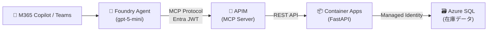
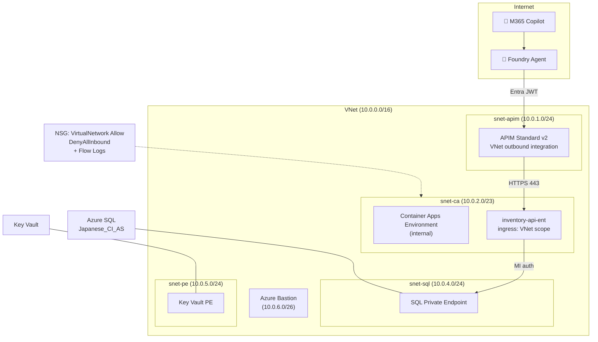

# Inventory Agent — Foundry + APIM MCP + M365 Copilot

[](https://github.com/naoki1213mj/M365Copilot-FoundryAgent-APIM-ACA_MCP-DB/actions/workflows/ci.yml)

Foundry エージェントが APIM (MCP Server) 経由で在庫 REST API を参照し、M365 Copilot / Teams で動くデモ。
`enableEnterpriseSecurity=true` でエンタープライズ本番構成（VNet, PE, KV, Bastion, Defender, MI, Grafana, アラート）に切り替え可能。

## Architecture

### 論理アーキテクチャ



### Enterprise ネットワーク構成



## API エンドポイント

| エンドポイント | 説明 | MCP ツール化 |
|-------------|------|------------|
| `GET /products` | 商品一覧 (category 絞り込み) | ✅ |
| `GET /products/{code}` | 商品コードで 1 件検索 | ✅ |
| `GET /inventory` | 在庫一覧 (倉庫/カテゴリ/発注点割れ) | ✅ |
| `GET /inventory/alerts` | 発注点割れ商品 (shortage/fill_rate ソート) | ✅ |
| `GET /warehouses` | 倉庫一覧 + 在庫サマリ | ✅ |
| `GET /warehouses/{code}/stock` | 特定倉庫の在庫詳細 + カテゴリサマリ | ✅ |

## Database

3 テーブル構成（正規化済み）:

| テーブル | 件数 | 説明 |
|---------|------|------|
| `products` | 20 | 商品マスタ (product_code, category, unit_price, reorder_point, supplier) |
| `warehouses` | 3 | 倉庫マスタ (KWS=川崎, OSK=大阪, FKO=福岡) |
| `inventory` | 31 | 在庫 (商品×倉庫, quantity, reserved, available=計算列). 発注点割れ 8 件 |

## Quick Start

```bash
# デモ（public 構成）
azd auth login
azd up

# 本番（エンタープライズ構成フル）
azd env set ENABLE_ENTERPRISE_SECURITY true
azd env set ALERT_EMAIL_ADDRESS ops@example.com
azd up

# ローカル開発
cp .env.sample .env  # 値を設定
cd src && pip install -r requirements.txt
uvicorn main:app --reload   # → http://localhost:8000/docs

# テスト
curl http://localhost:8000/health
curl http://localhost:8000/products/PRD-001
curl http://localhost:8000/inventory/alerts
curl http://localhost:8000/warehouses/KWS/stock

# ユニットテスト
pytest tests/ -v

# クリーンアップ
azd down --purge
```

## `azd up` 後の手動ステップ

### Step 0: 前提条件

```bash
# Entra ID アプリ登録（初回のみ）
bash scripts/setup-entra.sh
# 出力された Client ID を azd env に設定
azd env set ENTRA_APP_CLIENT_ID <出力された Client ID>
```

### Step 1: APIM VNet integration 確認 (enterprise のみ)

Azure ポータル → APIM → **Network** → **送信** で VNet integration が有効化されていることを確認。
APIM Standard v2 の outbound VNet integration は Bicep で `virtualNetworkType: External` を設定済みだが、ポータルで確認推奨。

### Step 2: APIM MCP Server 作成

> MCP Server の ARM API は未公開のためポータル手動操作が必要。

1. Azure ポータル → APIM → 左メニュー **MCP Servers**
2. **+ Create MCP server** をクリック
3. 設定:
   - **Source API**: `Inventory API`
   - **Name**: `inventory-mcp`（任意だが postprovision がこの名前を探す）
   - 全オペレーションを選択
4. **Create**

作成後の MCP endpoint: `https://<apim-name>.azure-api.net/inventory-mcp/mcp`

### Step 3: MCP policy 適用 + Agent 再作成

MCP Server 作成後に postprovision を再実行。Step 6 (MCP policy) と Step 7 (Agent) が自動実行される。

```bash
# azd env の値をシェルに読み込んで postprovision を実行
# Windows (PowerShell)
azd env get-values | ForEach-Object { if ($_ -match '^([^=]+)="?([^"]*)"?$') { [Environment]::SetEnvironmentVariable($matches[1], $matches[2]) } }
python scripts/postprovision.py

# postprovision 実行後の確認
# MCP policy: validate-azure-ad-token + rate-limit-by-key が適用されているか
# Agent: inventory-ent-pmi が作成されているか
```

### Step 4: Agent テスト

```bash
# Foundry ポータルのプレイグラウンドで直接テスト、または:
export FOUNDRY_PROJECT_ENDPOINT=$(azd env get-value FOUNDRY_PROJECT_ENDPOINT)
export AGENT_NAME=inventory-ent-pmi
python scripts/test_agent.py
```

テスト質問例:
- 「川崎倉庫で発注点割れしている商品を教えて」
- 「寝具カテゴリの在庫一覧」
- 「PRD-005 の商品情報を見せて」

### Step 5: M365 Copilot に公開

1. **Foundry ポータル** → `inventory-project` → Agents → `inventory-ent-pmi`
2. **Publish** → **Publish to Teams and M365 Copilot**
3. Bot Service 作成画面でメタデータを入力:

| フィールド | 値 |
|-----------|---|
| Name | `Inventory Assistant`（英語のみ） |
| Short description | `AI assistant that queries inventory data via MCP tools` |
| Full description | `Calls inventory REST API through APIM MCP Server` |
| Publisher | 組織名 |
| Website | `https://example.com` |
| Privacy / Terms | `https://example.com/privacy`, `https://example.com/terms` |

4. **Prepare Agent** → **Publish**
5. Scope: **Individual**（テスト用、管理者承認不要） or **Organization**（本番、M365 管理者承認要）

### Step 6: Teams で動作確認

M365 Copilot チャットまたは Teams で `@Inventory Assistant` を呼び出して動作確認。

> **Note**: M365 publish 後、agent identity が分離されるが APIM JWT policy は audience 検証のみなので追加設定不要。

## Tech Stack

| レイヤー | 技術 |
|---------|------|
| AI | Foundry Agent (gpt-5-mini) + MCP Protocol |
| API Gateway | APIM Standard v2 (MCP Server, JWT, rate-limit, payload limit, retry) |
| Backend | FastAPI / Python 3.12 / uvicorn (マルチステージ Docker, 非 root) |
| Database | Azure SQL (Entra ID Only, MI, Japanese_CI_AS) |
| Container | Container Apps (workload profiles, ACR remote build) |
| IaC | azd + Bicep |
| Auth | Entra ID (`validate-azure-ad-token` + ProjectManagedIdentity) |
| CI/CD | GitHub Actions (lint + test + security audit + Bicep validate + deploy) |
| 可観測性 | App Insights + 構造化ログ + KQL アラート 5 種 + Grafana Dashboard |
| DX | devcontainer (Codespaces), ruff, pytest, smoke test |

## Enterprise Security

`enableEnterpriseSecurity=true` で有効化:

- **ネットワーク分離**: VNet + 4 サブネット + NSG (DenyAllInbound) + NSG Flow Logs + Traffic Analytics
- **Container Apps**: internal CAE + VNet-scope ingress（インターネット非公開）
- **Private Endpoint**: SQL, Key Vault（public access disabled）
- **Azure Bastion**: Standard SKU (tunneling + IP connect) — トラブルシュート用
- **認証**: Managed Identity (Container Apps → SQL, ACR pull)、Entra JWT (APIM MCP)
- **Key Vault**: App Insights 接続文字列をシークレット管理 + 監査ログ
- **監視**: App Insights (APIM, CA) + Grafana Dashboard (Azure Monitor dashboards with Grafana)
- **アラート**: KQL 5 種 (API エラー率, APIM P95 レイテンシ, SQL CPU, CA リスタート, 認証失敗スパイク)
- **Diagnostic Settings**: SQL, Key Vault → Log Analytics
- **防御**: Defender for Cloud (SQL, Containers, Key Vault)
- **APIM ポリシー**: JWT 検証 + rate-limit + payload 1MB 制限 + retry/timeout + セキュリティヘッダー

詳細は [docs/enterprise-security.md](docs/enterprise-security.md) を参照。

## 自動化の範囲

`azd up` の postprovision hook (`scripts/postprovision.py`) で以下が自動実行される:

1. Foundry project 作成
2. Private DNS Zone 作成（internal CAE 用）
3. SQL データ投入 + MI ユーザー権限付与
4. APIM REST API import（OpenAPI spec 自動生成）
5. Foundry project connection 作成（ProjectManagedIdentity）
6. MCP policy 適用（MCP Server 存在時のみ）
7. Foundry agent 作成（MCP ツール + PMI 認証）
8. Agent Application publish
9. Grafana Dashboard パネル投入 (enterprise only)

## Project Structure

```
src/main.py              ← FastAPI 在庫 REST API (6 endpoints)
tests/test_api.py        ← pytest ユニットテスト (15 tests)
Dockerfile               ← マルチステージビルド + 非 root
infra/                   ← Bicep (azd provision)
  main.bicep             ← エントリポイント (enableEnterpriseSecurity フラグ)
  core/                  ← 個別モジュール
    sql.bicep            ← Azure SQL (Japanese_CI_AS, Diagnostics)
    apim.bicep           ← APIM Standard v2
    container-apps.bicep ← CA + App Insights
    network.bicep        ← VNet, NSG, Bastion, Flow Logs, Log Analytics
    keyvault.bicep       ← KV + シークレット + Diagnostics
    alerts.bicep         ← KQL アラート 5 種
    grafana-dashboard.bicep ← Azure Monitor dashboards with Grafana
    foundry.bicep        ← AI Services + モデルデプロイ
    defender.bicep       ← Defender for Cloud
    acr.bicep            ← Container Registry
scripts/
  postprovision.py       ← azd up 後の自動セットアップ (9 steps)
  create_agent.py        ← Foundry agent 作成
  test_agent.py          ← Foundry agent テスト
  setup.sql              ← 3 テーブル + サンプルデータ (products, warehouses, inventory)
  smoke_test.ps1         ← デプロイ後スモークテスト
  mcp-policy.json        ← MCP API ポリシーテンプレート
  setup-entra.sh         ← Entra ID app registration
.github/workflows/ci.yml ← CI/CD (lint + test + security + deploy)
.devcontainer/           ← Codespaces 対応
.env.sample              ← ローカル開発用環境変数テンプレート
pyproject.toml           ← ruff + pytest 設定
```

## ハマりポイント

- internal CAE で `ingress.external: false` → CA Environment 内のみ到達可。APIM から 404
- NSG source は `VirtualNetwork` タグで許可。サブネット CIDR では不十分
- APIM `validate-azure-ad-token` は MCP API スコープのみ。service 全体だと内部 tool call が 401
- APIM Frontend Response payload bytes = 0 を維持（MCP SSE 安定性）
- M365 publish の Name フィールドは英語のみ（日本語はエラー）

## License

MIT
